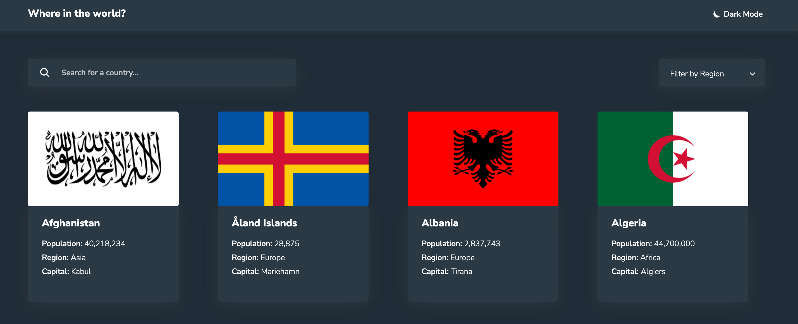

# Frontend Mentor - REST Countries API with color theme switcher solution

This is a solution to the [REST Countries API with color theme switcher challenge on Frontend Mentor](https://www.frontendmentor.io/challenges/rest-countries-api-with-color-theme-switcher-5cacc469fec04111f7b848ca). Frontend Mentor challenges help you improve your coding skills by building realistic projects.

## Table of contents

- [Installing](#installing)
- [Overview](#overview)
  - [The challenge](#the-challenge)
  - [Screenshot](#screenshot)
  - [Links](#links)
- [My process](#my-process)
  - [Built with](#built-with)
  - [Tests](#tests)

## Installing

```bash
# Clone this repository
$ git clone https://github.com/adityayaduvanshi/REST-Countries-API-with-color-theme-switcher.git

# Installing all the dependencies
$ yarn

# Run the app
$ yarn start
```

## Overview

### The challenge

Users should be able to:

- See all countries from the API on the homepage
- Search for a country using an `input` field
- Filter countries by region
- Click on a country to see more detailed information on a separate page
- Click through to the border countries on the detail page
- Toggle the color scheme between light and dark mode _(optional)_

### Screenshot



### Links

- Live Site URL :

## My process

### Built with

- React
- TypeScript
- React Router Dom
- REST Countries API
- React Query
- Axios
- Sass

### Tests

- Jest
- React Testing Library
- Mock Service Worker (MSW)
